# **WTF Academy**

If you are reading this, thank you for choose WTF Academy! Today we want to talk about our history and how this project begins. 

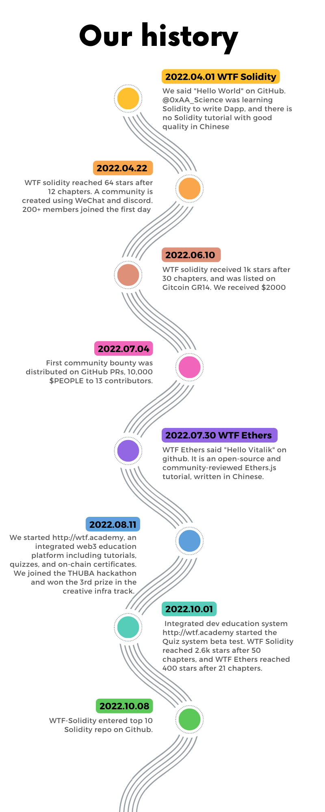
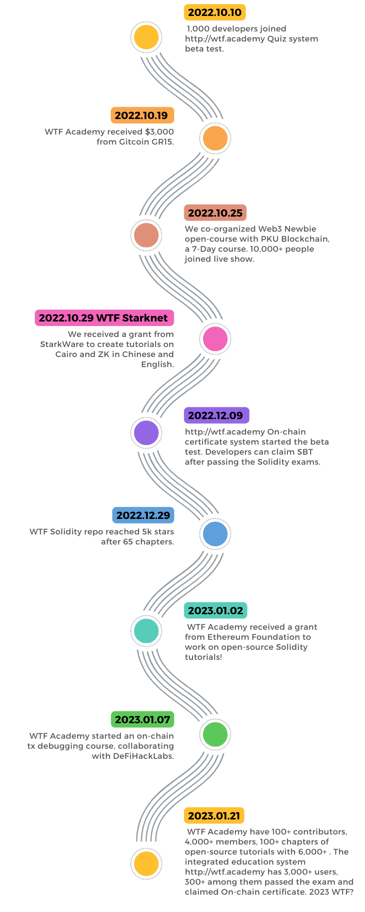

WTF Academy is a web3 open-source university aiming to onboard 10,000 developers to web3 space. After you complete the courses that we offer, you can claim your SBT certificate.

## How to use WTF Starknet

**To start to work in this platform.**

1. Go to main page, and click in "Starknet tutorials".

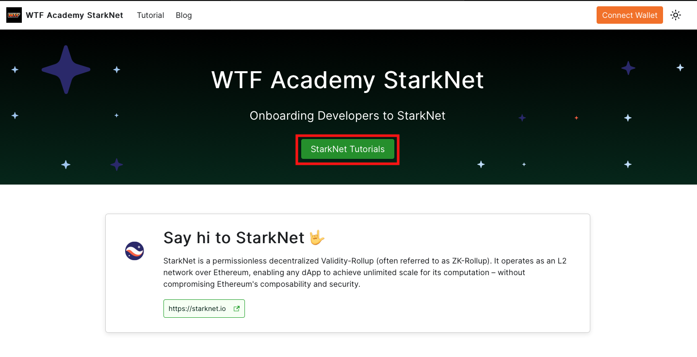

2.  You will see a dashboard and your progress

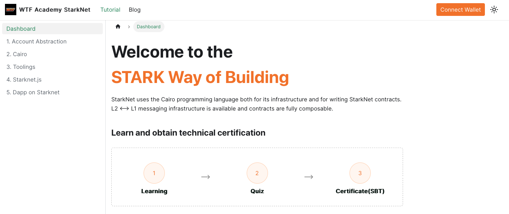

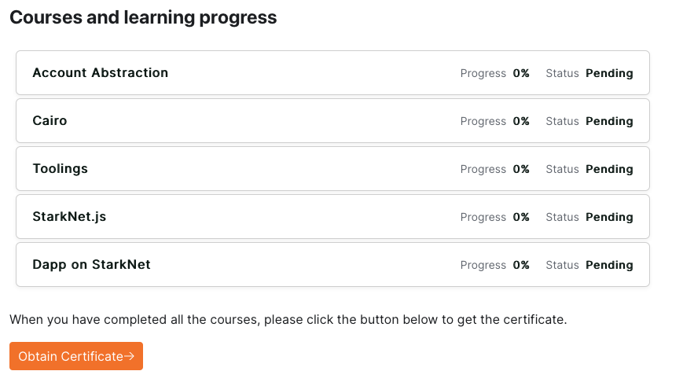

3. Read chapter 1 about Account Abstraction.

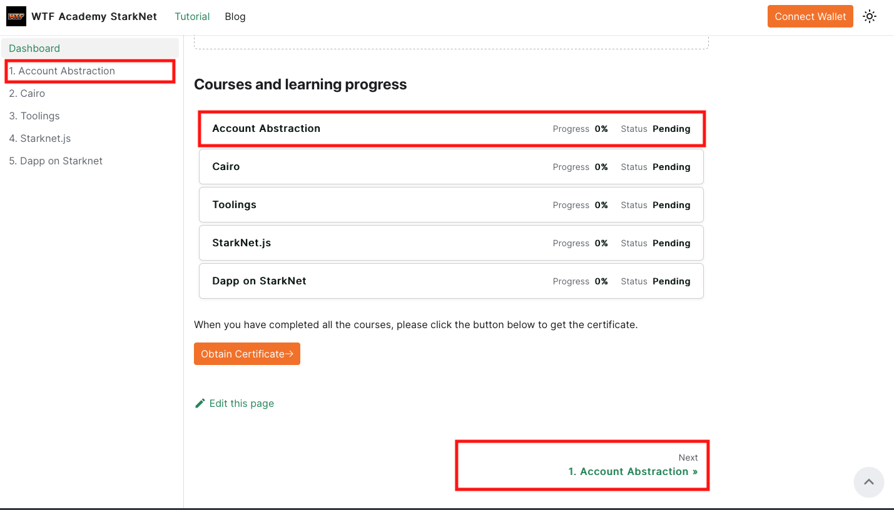

4. Follow the steps and create your wallet account to work in Starknet network.

*For Argent Wallet*

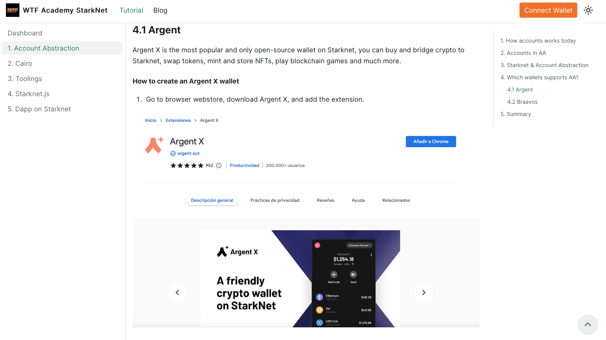

*For Braavos Wallet*

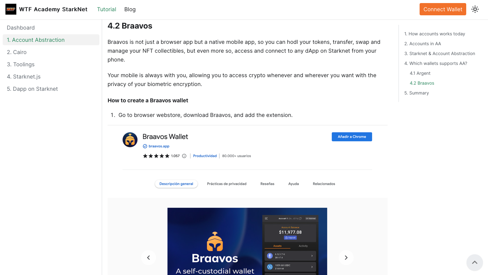

5. Connect your wallet to the platform.

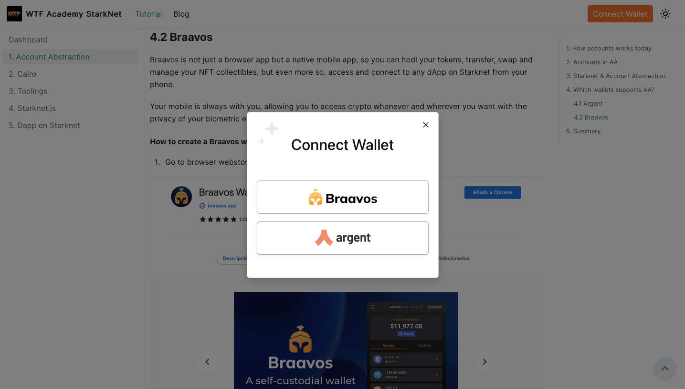

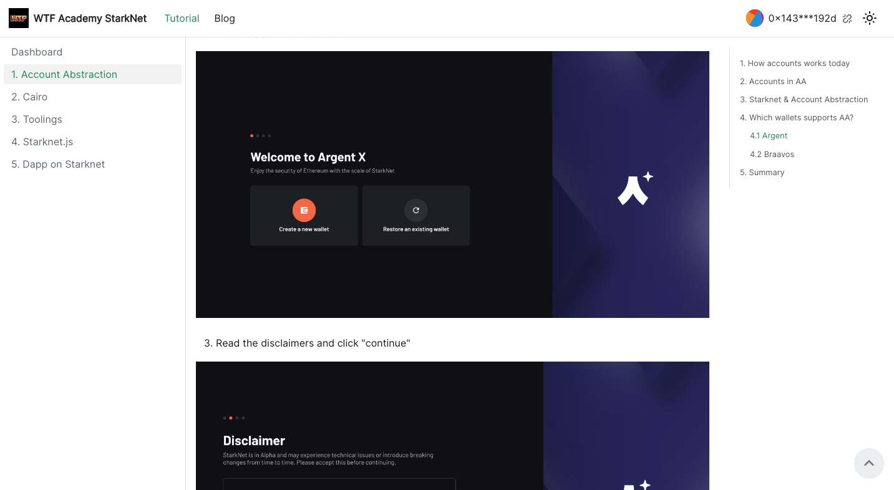

6. Answer the quizzes for each chapter. 

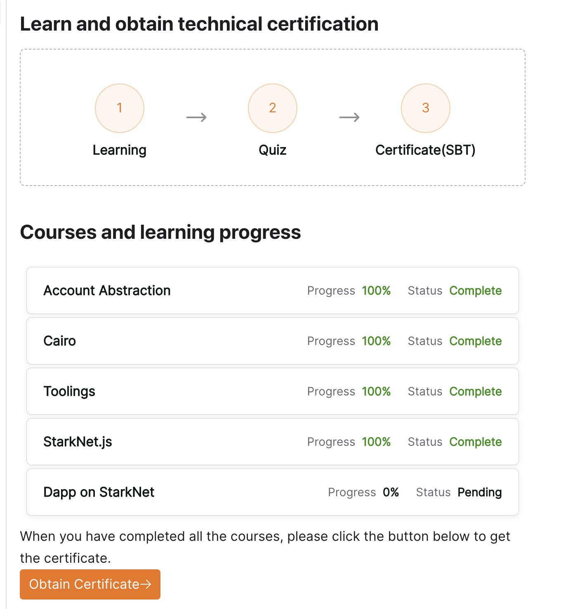

7. Once you finish all quizzes, you can claim your certificate!

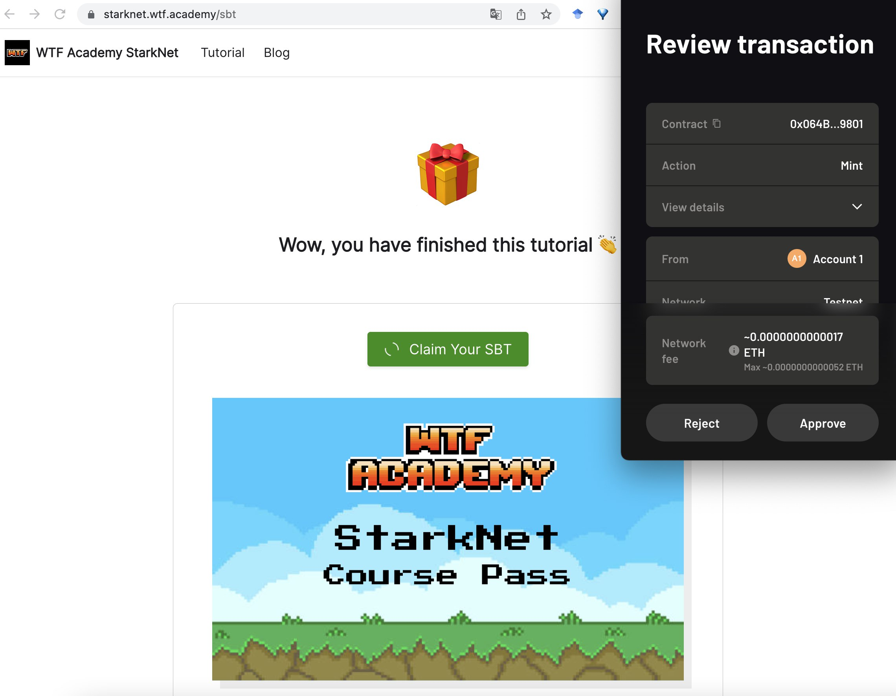

