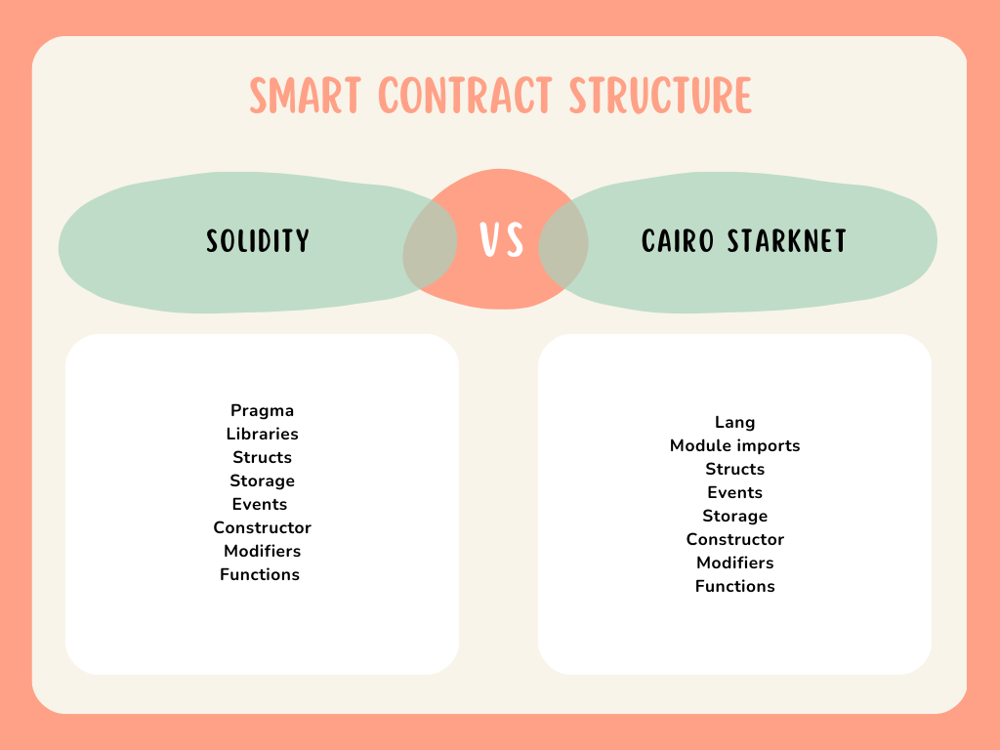
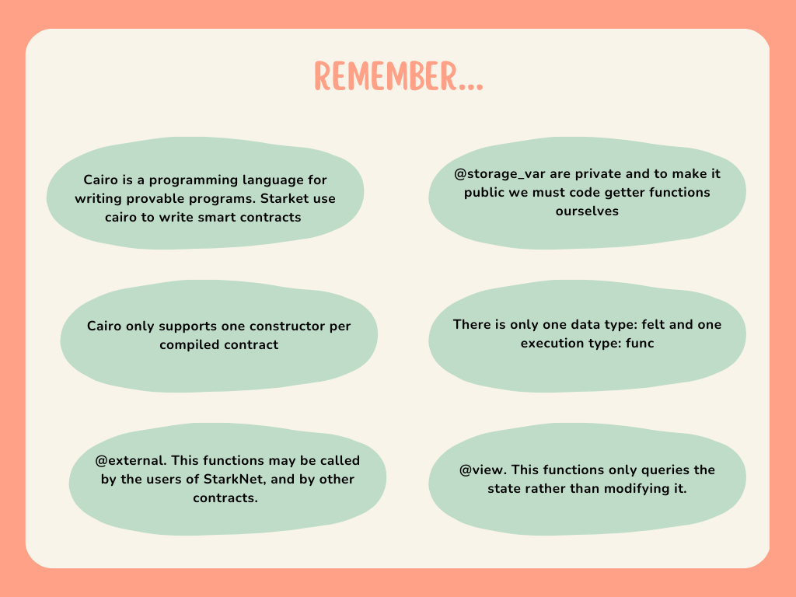

import QuizProgress from '@site/src/components/QuizProgress';
import QuizForm from '@site/src/components/QuizForm';
import {CourseId, Lesson_2} from "@site/src/constants/course";

<QuizProgress courseId={CourseId} lessonId={Lesson_2}></QuizProgress>

# WTF Starknet 2. Cairo

**Cairo** is a programming language for writing provable programs, where one party can prove to another that a certain computation was executed correctly. Cairo and similar proof systems can be used to provide scalability to blockchains.

Starknet uses the Cairo programming language both for its infrastructure and for writing Starknet contracts.

## 1. Structure of a cairo contract

If we compare the structure that we use in a solidity smart contract, usually they are organized as follows:



## 2. Difference between Solidity and Cairo

### 2.1 Getter function

The storage getters are necessary if you want to make them public. In Solidity, the compiler creates getters for all state variables declared as public, in Cairo all `@storage_var` are private. Thus if we want to make them public we must make a getter function ourselves.

### 2.2 Interface

When we create a Solidity instance from a contract, it inherits all the structs/errors/events/functions from the interface, and they commit to implement all the functions found there. However, in Cairo, there are interfaces but there is no inheritance. This means that we can’t just rely on the interface itself to provide us with the basic structure of our contract. 

### 2.3 Constructor

Also, a difference is that Cairo only supports one constructor per compiled contract (i.e. if a contract has multiple child contracts then there must only be one constructor defined across all).

### 2.4 Felt

The most important difference is primitive data types. There is only one data type: `felt`. 

A `felt` (field element) is the primitive data type in cairo, it stands for an unsigned integer with up to 76 decimals. It is used to store addresses, strings, integers, etc. We declare it with:

```
let magic_number = 666;
let my_address = "WTF Academy";
```

Cairo supports short strings of up to 31 characters but they're actually stored in `felt`. For example:

```
let hello_string = 'Hello world!'
```

There is only one execution type: func. All storage variables (except structs) such as mappings, events, constructors and functions are declared with the same func keyword:

```
@storage_var
func this_is_single_storage_slot() -> (value : felt):
end
```

```
@storage_var
func this_is_a_mapping_slot(key : felt) -> (value : felt):
end
```

```
@event
func this_is_an_event(event_param1 : felt, event_param2 : felt):
end
```

Since declaring everything with a func keyword can get confusing, Cairo provides decorators which are used on top of the function declarations to distinguish each. These all start with:

- `@event` - Represents an event
- `@storage_var` - Represents a contract state variable (ie mapping, address, etc.)
- `@constructor` - A constructor which runs once at deployment
- `@view` - Used to read from storage_vars
- `@external` - Used to write to storage_vars
- `@l1_handler` - Used to to process a message sent from an L1 contract 

## 3. Storage Variables

The `@storage_var` decorator declares a variable which will be kept as part of this storage. In the following example, this variable consists of a single `felt`, called balance. 

```
@storage_var
func balance() -> (res: felt) {
}
```

To use this variable, we will use the balance.read() and balance.write() functions which are automatically created by the `@storage_var` decorator. When a contract is deployed, all its storage cells are initialized to zero. In particular, all storage variables are initially zero.


Let's suppose that instead of maintaining one global variable balance, we would like to have a balance for each user (users will be identified by their STARK public keys). We need to change the balance storage variable to a map from public key (user) to balance (instead of a single value). This can be done by simply adding an argument:

```
@storage_var
func balance(user: felt) -> (res: felt) {
}
```

In fact, the `@storage_var` decorator allows you to add multiple arguments to create even more complicated maps. A storage variable does not have to be a single field element, it can also be a tuple of several field elements. For example, a mapping from user to a pair (min, max):

```
@storage_var
func range(user: felt) -> (res: (felt, felt)) {
}
```

An argument of a storage variable may also be a struct or a tuple, as long as they don’t contain pointers (such types, that don’t contain pointers, are called felts-only types). For example:

```
struct User {
    first_name: felt,
    last_name: felt,
}

// A mapping from a user to a value such as a vote for yes(1) or no(0).
@storage_var
func user_voted(user: User) -> (res: felt) {
}
```

## 4. Function

Starknet contracts have no main() function. Instead, each function may be annotated as an external using `@external` or internal function using `@view`.

- `@external`. This function may be called by the users of Starknet, and by other contracts. Allow to write the new value to a @storage_var.
- `@view`. This function only queries the state rather than modifying it. 

For example: 

``` 
%lang starknet

from starkware.cairo.common.cairo_builtins import HashBuiltin

// Define a storage variable.
@storage_var
func balance() -> (res: felt) {
}

// Increases the balance by the given amount.
@external
func increase_balance{syscall_ptr: felt*, pedersen_ptr: HashBuiltin*, range_check_ptr}(amount: felt) {
    let (res) = balance.read();
    balance.write(res + amount);
    return ();
}

// Returns the current balance.
@view
func get_balance{syscall_ptr: felt*, pedersen_ptr: HashBuiltin*, range_check_ptr}() -> (res: felt) {
    let (res) = balance.read();
    return (res=res);
}
```

This contract has one external function as: increase_balance reads the current value of balance from the storage, adds the given amount to it and writes the new value back to storage. get_balance is an internal function that simply reads the balance and returns its value.

Something that is present in our contract and we haven't talk yet is about implicit arguments. 

### 4.1 Implicit arguments

Basically they are internal bookkeeping for the compiler / Cairo VM. They're used to track the internal memory pointers across function calls. Without them, the compiler wouldn't know how/where to continue executing code after a function returns.

Consider the three implicit arguments: syscall_ptr, pedersen_ptr and range_check_ptr:

- pedersen_ptr, which allows to compute the Pedersen hash function.
- range_check_ptr, which allows to compare integers. 
- syscall_ptr allows the code to invoke system calls.

But it seems that the contract doesn’t use any hash function or integer comparison, so why are they needed? The reason is that storage variables require these implicit arguments in order to compute the actual memory address of this variable. This may not be needed in simple variables such as balance, but with maps computing the Pedersen hash is part of what read() and write() do. In this example, we are accessing to storage using system calls, so that why it is required the implicit argument syscall_ptr.

## 4.2 Function Arguments

Let's continue talking about functions. If we want to create an external function that may get an array of field elements as an argument, we need to define two consecutive argument: a_length of type `felt` and a of type `felt*`. These arguments are the length of the array and the pointer to the first element of the array. For example:

```
@external
func compare_arrays(
    a_len: felt, a: felt*, b_len: felt, b: felt*
) {
    assert a_len = b_len;
    if (a_len == 0) {
        return ();
    }
    assert a[0] = b[0];
    return compare_arrays(
        a_len=a_len - 1, a=&a[1], b_len=b_len - 1, b=&b[1]
    );
}
```

Now, consider a function that calldata arguments and return values may be of any type that does not contain pointers. E.g., structs with felt members, tuples of felts and tuples of tuples of felts. For example:

```
struct Point {
    x: felt,
    y: felt,
}

@view
func sum_points(points: (Point, Point)) -> (res: Point) {
    return (
        res=Point(
        x=points[0].x + points[1].x,
        y=points[0].y + points[1].y),
    );
}
```

In a similar way, passing arrays of structs is supported, as long as the structs do not contain pointers:

```
struct Point {
    x: felt,
    y: felt,
}
@external
func sum_points_arr(a_len: felt, a: Point*) -> (res: Point) {
    if (a_len == 0) {
        return (res=Point(0, 0));
    }
    let (res) = sum_points_arr(a_len=a_len - 1, a=&a[1]);
    return (res=Point(x=res.x + a[0].x, y=res.y + a[0].y));
}
```

## 5. Constructor

A contract may need to initialize its state before it is ready for public use. For example, one may want to designate a contract owner, that can do certain operations that other users can’t. Setting a storage variable to the owner can be done by the contract constructor. The contract constructor is defined using the `@constructor` decorator and its name must be constructor. The constructor semantics are similar to that of any other external function, except that the constructor is guaranteed to run during the contract deployment and it cannot be invoked again after the contract is deployed.

For example, we can define an ownable contract as follows:

```
%lang starknet

from starkware.cairo.common.cairo_builtins import HashBuiltin

// Define a storage variable for the owner address.
@storage_var
func owner() -> (owner_address: felt) {
}

@constructor
func constructor{
    syscall_ptr: felt*,
    pedersen_ptr: HashBuiltin*,
    range_check_ptr,
}(owner_address: felt) {
    owner.write(value=owner_address);
    return ();
}

@view
func get_owner{
    syscall_ptr: felt*,
    pedersen_ptr: HashBuiltin*,
    range_check_ptr,
}() -> (address: felt) {
    let (address) = owner.read();
    return (address=address);
}
```

## 6. Uint256

Everything in Cairo is represented by `felt`. `felt` stands for Field Element, the only data type in Cairo. it is a 251 bits unsigned integer.

Because a `uint256` number has 256 bits in size, it can not be represented by a 251-bit `felt`. Therefore, it is necessary to split the `uint256` number into two components: low and high. The low component represents the low 128 bits of the `uint256` number, and the high component is the high 128 bits of the `uint256` number. The binary value of low and high are padded with leading 0s up to the maximum resolution and put together side by side to form the `uint256` number.

`Uint256` is defined as a struct:

```
struct Uint256 {
    low: felt,
    high: felt,
}
```

## 7. Summary



<QuizForm link={"https://docs.google.com/forms/d/e/1FAIpQLSclhNbKlEGWM0HrAdlrU-GX6oQ0hi_A36oTJwUlobmVOsURKg/viewform?usp=sf_link"}></QuizForm>
