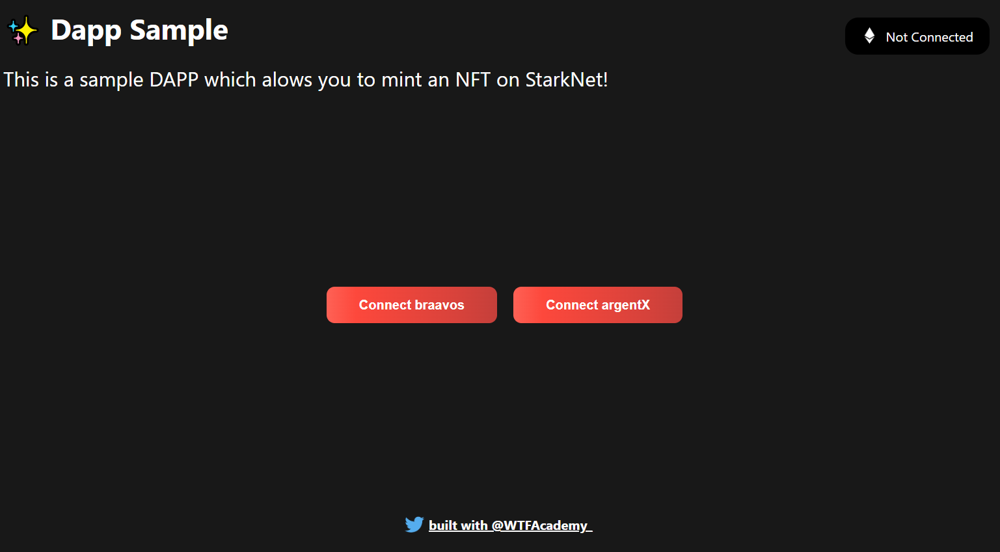

---

title: 5. Dapp on Starknet
tags:
  - cairo
  - starknet
  - starknetjs
  - wallet
  - contract
  - wtfacademy

---

import QuizProgress from '@site/src/components/QuizProgress';
import QuizForm from '@site/src/components/QuizForm';
import {CourseId, Lesson_5} from "@site/src/constants/course";

<QuizProgress courseId={CourseId} lessonId={Lesson_5}></QuizProgress>

# WTF Starknet 5: Starknet Dapp

Work in Progress... 

You will learn how to use `get-starknet` and `starknet-react` to build a simple dapp for minting NFTs on Starknet. 

A [demo](https://starknetfinal.kongtaoxing.repl.co/)



## get-starknet

[Get-starknet](https://github.com/starknet-io/get-starknet) provides a series of hooks that makes it easy to connect wallet to your DAPPs.

### 1. install

First, you need to get [VSCode](https://code.visualstudio.com/download) and [Node.js](https://nodejs.org/en/download/), then install `get-starknet` using following command:

`npm install get-starknet`

### 2. Basic Usage

Connect your DAPP with wallet using following command:

```javascript
import { connect, disconnect } from "get-starknet"

return <button onClick={() => connect()}>Connect wallet</button>
```

### 3. Advanced Usage

```javascript
import {
  type ConnectOptions,
  type DisconnectOptions,
  connect,
  disconnect,
} from "get-starknet";
return <button onClick = {() => connect({ modalMode: "alwaysAsk" })} Always ask </button>

return <button onClick = {() => connect({ 
    modalMode: "alwaysAsk",
	modalTheme: "dark",
})} Always ask with dark theme</button>

return <button onClick = {() => connect({ 
    modalMode: "alwaysAsk",
	modalTheme: "light",
})} Always ask with light theme</button>

return  <button onClick={connect({ modalMode: "neverAsk" })}> Never ask </button>
 
return <button onClick={disconnect()}>Disconnect</button>

return <button onClick={disconnect({ clearLastWallet: true })}> Disconnect and reset </button>
```


## starknet-react

[Starknet-react](https://github.com/apibara/starknet-react)  provides a collection of React hooks for StarkNet.

### 1. install

Install `starknet-react`using following command.

`npm add @starknet-react/core`

### 2. Usage

Before using hooks of `starknet-react`, you need to import following statements to `_app.jsx` file.

```javascript
import { StarknetConfig, InjectedConnector } from '@starknet-react/core'
```

Then edit the application component to include the StarkNet provider.
```javascript
function AppContainer({ Component, pageProps }) {
  const connectors = [
    new InjectedConnector({ options: { id: 'braavos' }}),
    new InjectedConnector({ options: { id: 'argentX' }}),
  ]
  return (
    <StarknetConfig connectors={connectors}>
      <App {...pageProps} />
    </StarknetConfig>
  )
}
```

### 3.Hooks

#### `useAccount`

`useAccount` allows you to access the AccountInterface object provided by current wallet like Argent X or Braavos.

Examples:

```javascript
function GetWallet() {
  const { account, address, status } = useAccount()

  if (status === 'disconnected') return <p>Disconnected</p>
  return <p>Account: {address}</p>
}
```


#### `useConnectors`

​	`useConnector` provides ways to interact with the connectors. Please notice that he available connectors are computed as soon as the hook is rendered, which could happen *before* the browser wallets had the opportunity to inject themselves in the page. You should periodically refresh the available connectors.

Examples:

```javascript
function ConnectWallet() {
  const { connect, connectors, disconnect, available, refresh } = useConnectors()

  useEffect(() => {
    // refresh theavailable connectors every 5 seconds
    const interval = setInterval(refresh, 5000)
    return () => clearInterval(interval)
  }, [refresh])

  return (
    // connect wallet
    <ul>
      {available.map((connector) => (
        <div key={connector.id()}>
         <button key={connector.id()} onClick={() => connect(connector)}>
          Connect {connector.id()}
         </button>
        </div>
      ))}
    </ul>
	// disconnect wallet
	<div>
     <button onClick = {disconnect}> Disconnect </button>
	</div>
  )
}
```


#### `useStarknetExecute`

`useStarknetExecute` is used to interact with contracts on StarkNet and send multicall transactions.

Example:

```javascript
function ExecuteTransaction() {
  const { address } = useAccount()
  const [count, setCount] = useState(0)

  // define calls
  const calls = useMemo(() => {
    const tx = {
      contractAddress: ethAddress,
      entrypoint: 'transfer',
      calldata: [address, 1, 0]
    }
    return Array(count).fill(tx)
  }, [address, count])

  // execute transaction
  const { execute } = useStarknetExecute({ calls })

  return (
    <>
      <p>Sending {count} transactions</p>
      <p>
        <button onClick={execute}>Execute</button>
      </p>
    </>
  )
}
```

## Summary

In this tutorial, we introduced how to use `get-starknet` and `starknet-react`  to build DAPPs on StarkNet.

<QuizForm link={""}></QuizForm>
