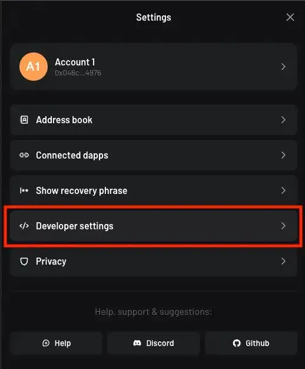
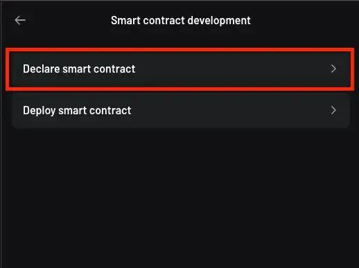
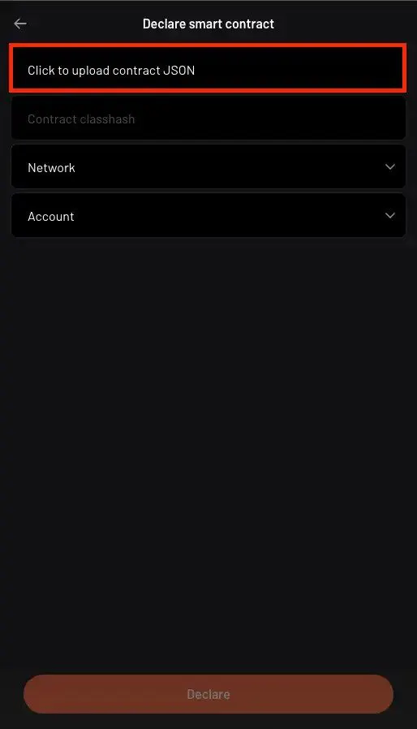
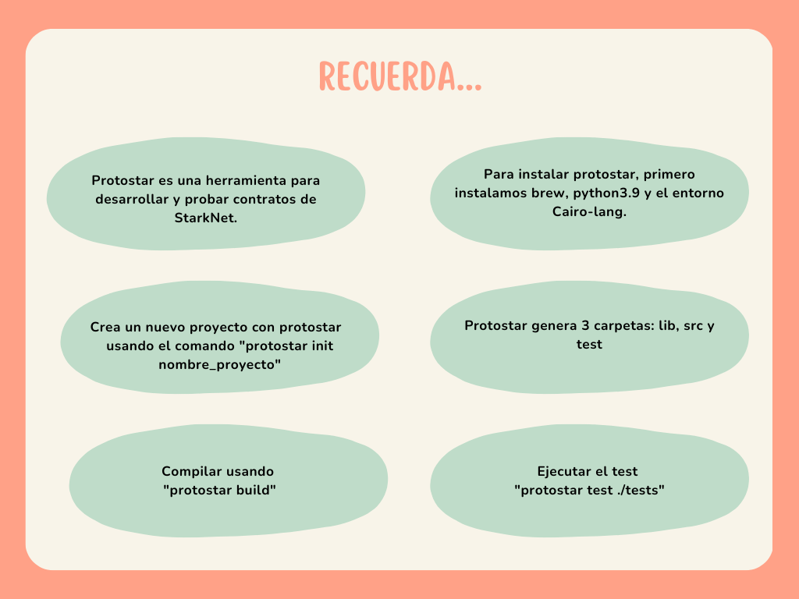

import QuizProgress from '@site/src/components/QuizProgress';
import QuizForm from '@site/src/components/QuizForm';
import {CourseId, Lesson_3} from "@site/src/constants/course";

<QuizProgress courseId={CourseId} lessonId={Lesson_3}></QuizProgress>

# WTF Starknet 3: Toolings

## 1. Protostar

Protostar is a toolchain for developing and testing starknet contracts, comparable to Foundry in Solidity, allowing us to create tests using cairo language. 

In Account Abstraction section we show how to create your Argent Wallet account. So, today we are going to learn how to configurate to use this wallet with protostar. If you have questions, you can consult the official documentation [here](https://docs.swmansion.com/protostar/docs/tutorials/introduction)

To Install protostar, first we need to obtain brew, python3.9 and Cairo-lang environment in our computer. Open terminal and use the following command:

- To install brew: 
```
/bin/bash -c "$(curl -fsSL https://raw.githubusercontent.com/Homebrew/install/HEAD/install.sh)" 
```

- To install python3.9:

	- Using brew: 
``` 
brew install python@3.9
```

	- Using python official page: 
```
https://www.python.org/downloads/release/python-390/
```

- Install gmp: 
```
brew install gmp
```

- Install cargo-lang python package: 
```
pip3 install cairo-lang
```

Now, we are going to install protostar to be able to use it with a new cairo project. Copy and run in a terminal the following command:

```
curl -L https://raw.githubusercontent.com/software-mansion/protostar/master/install.sh | bash
```

Restart terminal and verify that installation is complete, run: 
```
protostar -v
```

### 1.1 Setting up a new project using protostar. 

To initialize the new project, run the following command:
```
protostar init your-project-name
```

With this command, you generate 3 directories: 
- src: A directory for your code.
- lib: A default directory for external dependencies.
- tests: A directory storing tests.

Also, `protostar.toml` is the file which contains your command configurations. According to the official docs, it can be used to avoid passing arguments every time you run a command. Protostar searches for an argument value in the `["protostar.COMMAND_NAME"]` section, for example: 

```
["protostar.build"]
cairo-path = ["./lib/cairo_contracts/src"]
```

We put our source code in src directory and we can create tests.

### 1.2 Test in protostar

Protostar provides a flexible testing environment for Cairo smart contracts. When we want to test a function, we create in the tests directory a new file called `test_[FUNCTION_NAME].cairo`, which contains a single test case. 

To execute our tests, we run:
```
protostar test ./tests
```

After our contract passed the test, then we are going to compile the source file running:
```
protostar build
```

Once we run this command, we obtain:
```
Building projects' contracts                                                                                                                                
Class hash for contract "main": 0x63c8113870a0028905684995a4b64460287a0e4c816e93ce70f9327316d3ea3
17:52:32 [INFO] Execution time: 6.07 s
```

If it's the first time you are using protostar, is necessary to deploy the account using `protostar calculate-account-address` command

```
protostar calculate-account-address --account-class-hash [ACCOUNT_CLASS_HASH] --account-address-salt 1 
```

The value of `[ACCOUNT_CLASS_HASH]` is calculated when we create our account using ArgentX (check Account Abstraction section)and can be viewed on Starkscan or Voyager using our account address. After `protostar calculate-account-address` command, we obtain:

```
Address: 0x00b89a4302ea68352488fe1bcc9b0e01cd71dc4d630e5e69194c9e60084996fe                                                                                 
17:55:47 [INFO] Execution time: 2.57 s
```

Also, we need to export the private key of the account. We check for `PROTOSTAR_ACCOUNT_PRIVATE_KEY` environment variable, and use it if it's available.

```
export PROTOSTAR_ACCOUNT_PRIVATE_KEY=[PRIVATE_KEY_FROM_ARGENTX_WALLET] 
```

Now, let’s declare the json contract: 

```
protostar declare ./build/main.json --account-address [ACCOUNT_ADDRESS_FROM_ARGENTX_ WALLET] —max-fee auto —network testnet 
```

The result of this command is:
```
Declare transaction was sent.                                                                                                                               
Class hash: 0x063c8113870a0028905684995a4b64460287a0e4c816e93ce70f9327316d3ea3 <----- KEEP THIS VALUE
StarkScan https://testnet.starkscan.co/class/0x063c8113870a0028905684995a4b64460287a0e4c816e93ce70f9327316d3ea3
Voyager   https://goerli.voyager.online/class/0x063c8113870a0028905684995a4b64460287a0e4c816e93ce70f9327316d3ea3

Transaction hash: 0x045877346ba1ea22a15012e4a028c33196592c35d3d0f94471744fd8c52cbc22
StarkScan https://testnet.starkscan.co/tx/0x045877346ba1ea22a15012e4a028c33196592c35d3d0f94471744fd8c52cbc22
Voyager   https://goerli.voyager.online/tx/0x045877346ba1ea22a15012e4a028c33196592c35d3d0f94471744fd8c52cbc22
18:00:50 [INFO] Execution time: 11.63 s
```

With this last command, we obtain the `[CLASS_HASH]` that we are going to use to deploy the contract to the testnet:
```
protostar deploy [CLASS_HASH] --network testnet --max-fee auto --account-address [ACCOUNT_ADDRESS_FROM_ARGENTX_ WALLET]
```

We obtain: 
```
Invoke transaction was sent to the Universal Deployer Contract.                                                                                             
Contract address: 0x03af31eac66655778fe4cd6614416657557dc685c703e020a10477a656e2ca42
StarkScan https://testnet.starkscan.co/contract/0x03af31eac66655778fe4cd6614416657557dc685c703e020a10477a656e2ca42
Voyager   https://goerli.voyager.online/contract/0x03af31eac66655778fe4cd6614416657557dc685c703e020a10477a656e2ca42

Transaction hash: 1069811621407037610972459756819955221880607029463709887313447568671420675488
StarkScan https://testnet.starkscan.co/tx/0x025d7dee76458b782d106006f6d0bf8337b8854f7f2c1433053fbb999b4375a0
Voyager   https://goerli.voyager.online/tx/0x025d7dee76458b782d106006f6d0bf8337b8854f7f2c1433053fbb999b4375a0
18:05:52 [INFO] Execution time: 4.61 s
```

Now we can use protostar to work in our projects. Let's continue learning Cairo/Starknet and talk about ERC721.

## 2. ERC721 on Starknet

The ERC721 standard is used to represent non-fungible tokens. The most popular use case has been PFP (Profile Picture) NFTs, commonly used to create digital online identities. Other use cases include tokenization of digital assets, memorabilia for experiences, and digital art. Thanks to OpenZeppelin, they developed an ERC721 Cairo implementation that supports any use case that can be done with the Solidity implementation.

### 2.1 How to deploy an ERC721

To deploy an ERC721, let's use the following [OpenZeppelin contract](https://github.com/OpenZeppelin/cairo-contracts/blob/release-v0.5.0/src/openzeppelin/token/erc721/presets/ERC721MintableBurnable.cairo) to work and deploy in the testnet.

NB: We'll be using the official Starknet CLI
First, we need to create and fund a Starknet account. To do that, run the following command:

``` 
starknet new_account
```

Go to the goerli faucet and obtain some funds, this is necessary to deploy the account. Once, you have funds, let's deploy the account: 

```
deploy_account 
```

Now, to build our ERC721 contract, create a new contract and copy the contract that provides in the [OpenZeppelin contract](https://github.com/OpenZeppelin/cairo-contracts/blob/release-v0.5.0/src/openzeppelin/token/erc721/presets/ERC721MintableBurnable.cairo), save it and compile it: 

```
starknet-compile contracts/ERC721_exercise01.cairo --output contracts/artifacts/ERC721.json
```

If everything is ok, now we are going to check our constructor. This constructor expects 3 arguments name, symbol and owner, these arguments are declared as felt type but we are going to define name and symbol arguments as a string, to transform string or hex to a felt Starkware provides a "utils.py" file to do it and then use the correct values to send it to the constructor. The file is [here](https://github.com/hasselalcala/workshop_ERC721_Starknet/blob/main/utils.py)

Run the following:

```
python -i utils.py

str_to_felt("ANIMAL") 
$ 71804493054284 <--- argument 1 

str_to_felt("ANI") 
$ 4279881 <--- argument 2 

hex_to_felt("0x01432C1d26d4b210A8cd7e3418F5aad4886FCA75b579da88D73c3C0902E192dD") <---- we use our argent wallet address 
$ 570996064690495235118339479854624184141230437508569589214736207591531188957 <--- argument 3
```

With this arguments, we can declare and deploy our contract, as follows:

```
starknet declare --contract contracts/artifacts/ERC721.json --account=[ARGENT_WALLET_ADDRESS] --network alpha-goerli --no_wallet --sender [ARGENT_WALLET_ADDRESS] --max_fee 1
```

We obtain the contract class hash, that is use it to deploy the contract.

```
Declare transaction was sent. 
Contract class hash: 0x4769fe9a34a934c169acbc3cb4d7e0a14c66545ca2eed0df9ab658c1015e596 <-- use this value to deploy the contract Transaction hash: 0x2f5d5541776af32faf248458dd728e4c43e92d1b36ecfcd1acb733432782d96
```

To deploy

```
starknet deploy --inputs 71804493054284 4279881 570996064690495235118339479854624184141230437508569589214736207591531188957 --network alpha-goerli --class_hash 0x4769fe9a34a934c169acbc3cb4d7e0a14c66545ca2eed0df9ab658c1015e596
```

Once the contract is deployed we go to the contract using voyager and mint a new token using the address to define the owner of the token and a token_id.

## 3. Deploying a contract using Argent Wallet

Now that we are familiar with writing and compiling Cairo contracts, We can also use the argent wallet to declare and deploy a contract. First, we need to open our Argent X, and click on the settings icon at the top-right, select "Developer settings" and "Smart contract development"  





To deploy a contract, we need to get the classhash by declaring the contract. To declare the contract, select “Declare smart contract”, but first we need to compile our contract to obtain the `.json`files. To compile our `ERC721.cairo`, run:

````
starknet-compile contracts/ERC721_exercise01.cairo --output contracts/artifacts/ERC721.json --abi contracts/artifacts/ERC721_abi.json
````

Then return to Argent Wallet, "Declare smart contract" -> "click to upload contract json" and pick your `ERC721_abi.json`, choose a network and your account.





Once we declare the contract, we can deploy it. Again, you need to select the network the contract will be deployed on and the account used for deployment. Once you’ve done that the constructor input fields will pop up automatically. Fill in the constructor parameters and choose a random salt (5 in our case). 


You can also use a unique address and finally press “Deploy” button to deploy the contract. Sign the transaction, and you’ll be redirected to a page with your deployed contract address. 

Having deployed your contract to Starknet, you can use Voyager/Starkscan to interact with it.

## 4. Summary



<QuizForm link={"https://docs.google.com/forms/d/e/1FAIpQLSdGCStMqRq1rvDv_fRF7poL8MvZvMT_YddCQE0mchKk4HnKcw/viewform?usp=sf_link"}></QuizForm>
